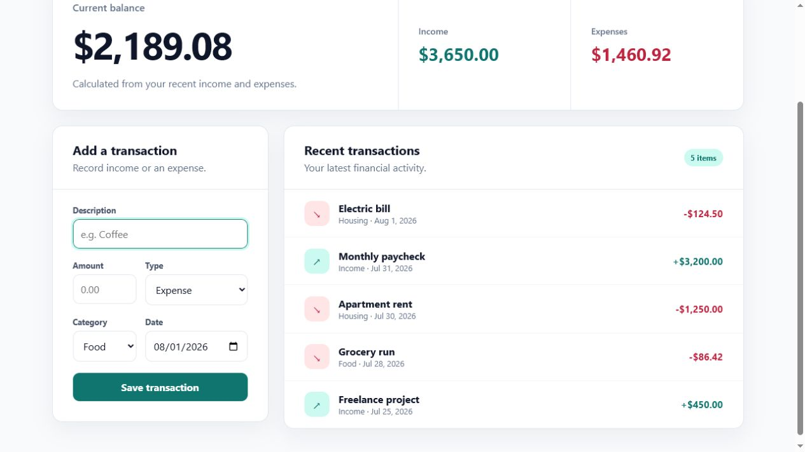

# Personal Expense Tracker

A simple, responsive personal expense tracker built with React and Vite. The
project is designed to demonstrate core React concepts while growing into a
useful tool for recording transactions and monitoring spending.

## Working demo

The app starts with sample transaction data and lets you add income or expenses
through a controlled React form. New transactions immediately update the
summary totals, item count, and recent-transactions list.

### Transaction dashboard


### After adding an expense



## Current features

- Reusable summary, form, list, and transaction-item components
- Controlled inputs for description, amount, type, category, and date
- Add income and expense transactions to React state
- Basic validation for descriptions and positive amounts
- Form reset and focus management after submission
- Stable generated transaction IDs used as React keys
- Derived balance, income, and expense totals
- Responsive application layout
- Accessible headings, regions, focus styles, and controls

## Planned features

- Edit and delete transactions
- Filter transactions by type and category
- Save transactions with local storage

## Built with

- React
- Vite
- CSS
- Oxlint

## Run locally

```bash
npm install
npm run dev
```

Open the local URL printed by Vite in your browser.

## Available scripts

```bash
npm run dev      # Start the development server
npm run build    # Create a production build
npm run lint     # Check the source with Oxlint
npm run preview  # Preview the production build
```
