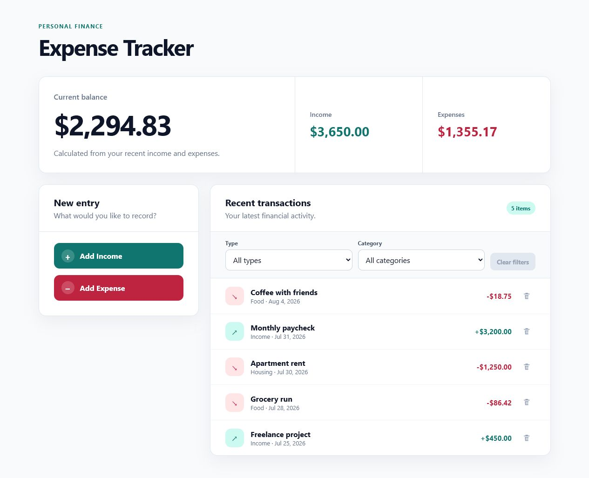
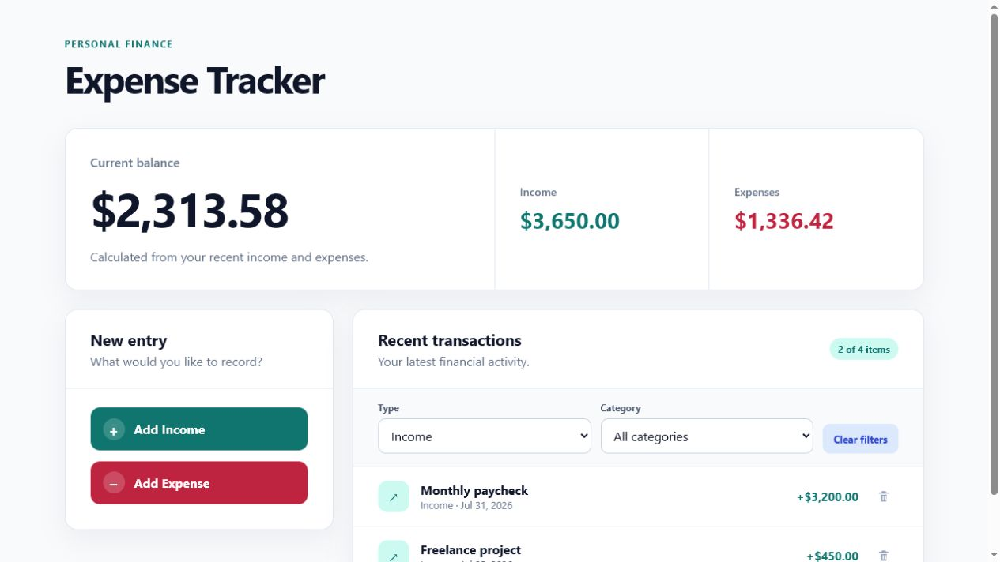
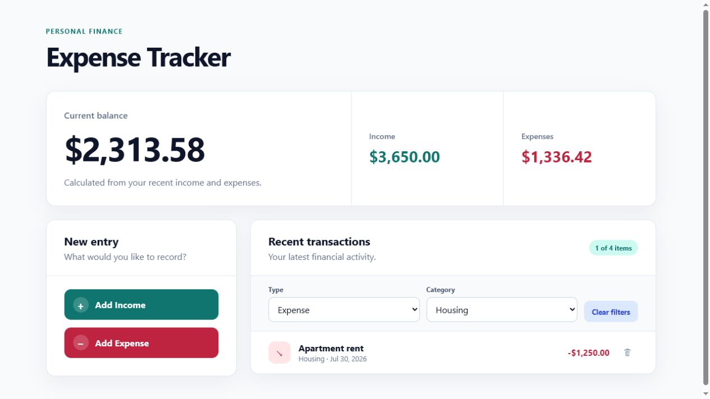
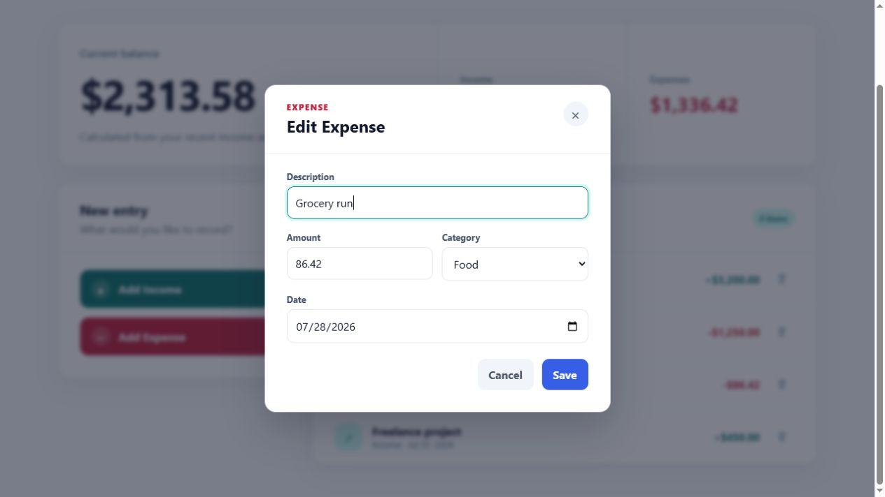

# Personal Expense Tracker

[](https://github.com/navinrtnk/personal-expense-tracker/actions/workflows/test.yml)

A simple, responsive personal expense tracker built with React and Vite. The
project is designed to demonstrate core React concepts while growing into a
useful tool for recording transactions and monitoring spending.

## Working demo

The app starts with sample transaction data and provides separate actions for
adding income and expenses. Each action opens a focused modal form with the
transaction type already selected. New entries immediately update the summary
totals, item count, and recent-transactions list. Transactions are saved in the
browser's local storage, so additions, edits, and deletions persist across page
refreshes without requiring an account or backend.

### Transaction dashboard


### Persist transactions

Transactions are stored in the browser after every addition, edit, or deletion.
The dashboard below shows a newly added expense still present after refreshing
the page.



### Filter transactions

Type and category filters can be combined without changing the overall summary
totals. Category choices adapt to the selected transaction type.

#### Type filter



#### Type and category filters



### Add Income

The income category is preselected and locked so income entries are always
classified consistently.


### Add Expense

The expense form offers only expense-related category choices.


### Edit a transaction

Clicking a transaction row opens a prefilled edit modal. Changes are applied
with the blue Save action.



### Delete a transaction

Each transaction has a delete control that opens a confirmation dialog before
the entry is removed.


## Built with

- React
- Vite
- CSS
- Oxlint
- Vitest
- React Testing Library

## Tests

The test suite covers the initial sample dashboard, calculated totals, modal
defaults, adding income and expenses, category rules, validation, and rendered
transaction updates. It also verifies canceling and confirming transaction
deletion, editing existing transactions, and the resulting summary calculations.
Filter coverage includes individual and combined filters, context-aware category
options, unchanged summary totals, no-results feedback, and clearing filters.
Persistence coverage verifies loading saved transactions, preserving an empty
saved list, falling back safely when stored data is malformed, and saving new
transactions.

Run the complete suite once:

```bash
npm test
```

Run tests in watch mode while developing:

```bash
npm run test:watch
```

## Run locally

```bash
npm install
npm run dev
```

Open the local URL printed by Vite in your browser.

## Available scripts

```bash
npm run dev      # Start the development server
npm run build    # Create a production build
npm run lint     # Check the source with Oxlint
npm run preview  # Preview the production build
npm test         # Run the test suite once
npm run test:watch # Run tests in watch mode
```
