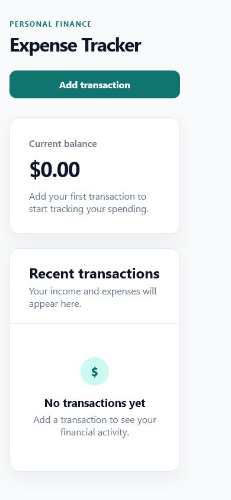

# Personal Expense Tracker

A simple, responsive personal expense tracker built with React and Vite. The
project is designed to demonstrate core React concepts while growing into a
useful tool for recording transactions and monitoring spending.

## Working demo

The initial version includes a responsive application shell, a current-balance
summary, a clear call to action, and an empty state for recent transactions.

### Desktop


### Mobile



## Current features

- Responsive desktop and mobile layout
- Current-balance summary card
- Recent-transactions section
- Helpful empty state for new users
- Accessible headings, regions, focus styles, and controls

## Planned features

- Add, edit, and delete transactions
- Track income and expenses separately
- Calculate income, expenses, and current balance
- Filter transactions by type and category
- Save transactions with local storage

## Built with

- React
- Vite
- CSS
- Oxlint

## Run locally

```bash
npm install
npm run dev
```

Open the local URL printed by Vite in your browser.

## Available scripts

```bash
npm run dev      # Start the development server
npm run build    # Create a production build
npm run lint     # Check the source with Oxlint
npm run preview  # Preview the production build
```
