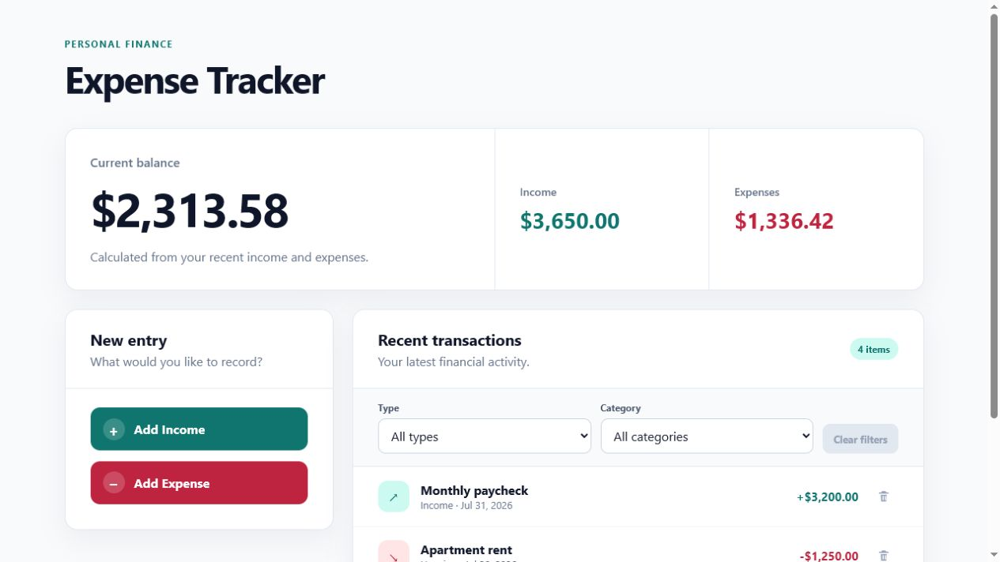
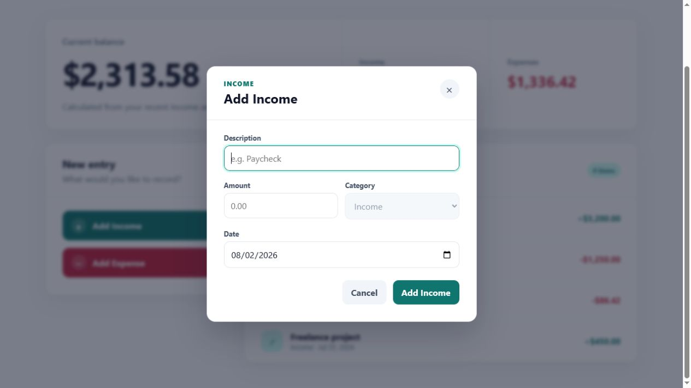
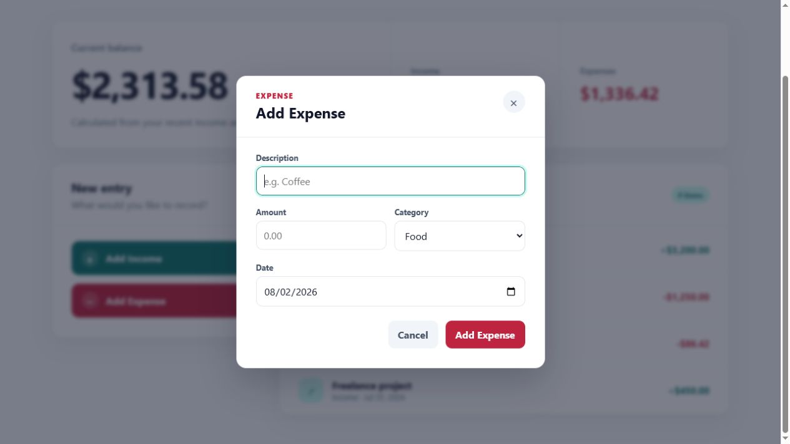
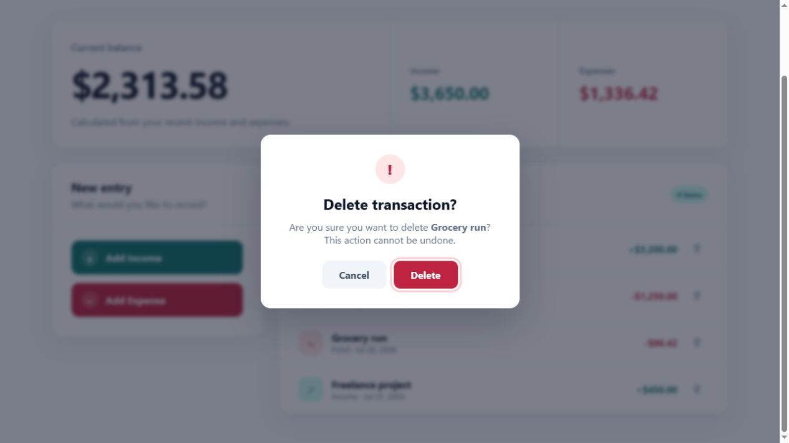

# Personal Expense Tracker

[](https://github.com/navinrtnk/personal-expense-tracker/actions/workflows/test.yml)

A simple, responsive personal expense tracker built with React and Vite. The
project is designed to demonstrate core React concepts while growing into a
useful tool for recording transactions and monitoring spending.

## Working demo

The app starts with sample transaction data and provides separate actions for
adding income and expenses. Each action opens a focused modal form with the
transaction type already selected. New entries immediately update the summary
totals, item count, and recent-transactions list.

### Transaction dashboard



### Add Income

The income category is preselected and locked so income entries are always
classified consistently.



### Add Expense

The expense form offers only expense-related category choices.



### Delete a transaction

Each transaction has a delete control that opens a confirmation dialog before
the entry is removed.



## Current features

- Reusable summary, form, list, and transaction-item components
- Separate Add Income and Add Expense actions
- Modal forms with type-specific headings and no redundant type dropdown
- Income category locked to Income and expense-only category choices
- Controlled inputs for description, amount, category, and date
- Add income and expense transactions to React state
- Edit transactions by clicking anywhere on a transaction row
- Prefill the modal with the selected transaction's current values
- Delete transactions through a confirmation dialog
- Recalculate balance, income, and expenses after edits or deletion
- Basic validation for descriptions and positive amounts
- Escape, Cancel, and Close controls for dismissing the modal
- Automatic form focus when a modal opens
- Stable generated transaction IDs used as React keys
- Derived balance, income, and expense totals
- Responsive application layout
- Accessible headings, regions, focus styles, and controls

## Planned features

- Filter transactions by type and category
- Save transactions with local storage

## Built with

- React
- Vite
- CSS
- Oxlint
- Vitest
- React Testing Library

## Tests

The test suite covers the initial sample dashboard, calculated totals, modal
defaults, adding income and expenses, category rules, validation, and rendered
transaction updates. It also verifies canceling and confirming transaction
deletion, editing existing transactions, and the resulting summary calculations.

Run the complete suite once:

```bash
npm test
```

Run tests in watch mode while developing:

```bash
npm run test:watch
```

## Run locally

```bash
npm install
npm run dev
```

Open the local URL printed by Vite in your browser.

## Available scripts

```bash
npm run dev      # Start the development server
npm run build    # Create a production build
npm run lint     # Check the source with Oxlint
npm run preview  # Preview the production build
npm test         # Run the test suite once
npm run test:watch # Run tests in watch mode
```
